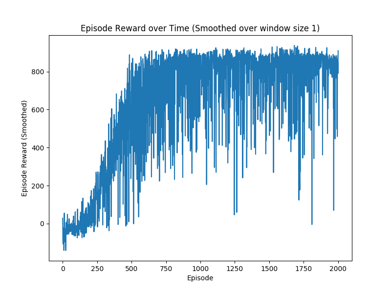

# car_racing_dqn

## Introduction
A solution for Carracing-V0 from OpenAi gym using Deep Q-learning. The DQN model is built on the solution for Breakout-V0 from https://github.com/dennybritz/reinforcement-learning
## Requirements
Python 3.5 \
Tensorflow 1.15.0 \
CUDA 10.1\
cuDNN 7.6

## Installation
Install all required dependencies

```
pip install -r requirements.txt
```

## Run
```
Train the model. It takes 8 hours to train 2000 episodes on GTX1070 GPU
python car_racing_dqn_train.py

# Change the action space disretization in 
action_config.py

# Test the trained model over 100 trials, this test reads the lateset checkpoint
python car_racing_dqn_test.py
```

## Result
Average total reward ~800 on 100 trials\

Episode Rewards:


50th Episode 
\
650th Episode 
\
2000th Episode 
